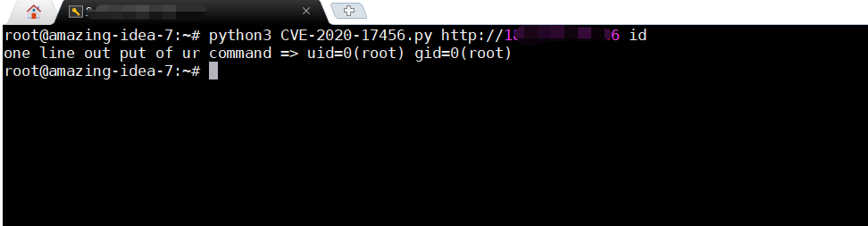

## Description

On August 21, 2020, seown SLC 130 router was exposed to have an authentication rce vulnerability. The vulnerability number is cve-2020-17456. The vulnerability is due to the ping command injection in the router's Web service diagnosis function. Combined with several groups of hard coded credentials, unauthorized attackers can bypass authentication and execute arbitrary commands on the target device with root privileges. 


## How to use
```
python CVE-2020-17456.py http://192.168.1.1 id
```
eg:



## Other

If you want read full post about SLC-130 And SLR-120S Routers Exploit please visit the page below : 

https://maj0rmil4d.github.io/Seowon-SlC-130-And-SLR-120S-Exploit/

